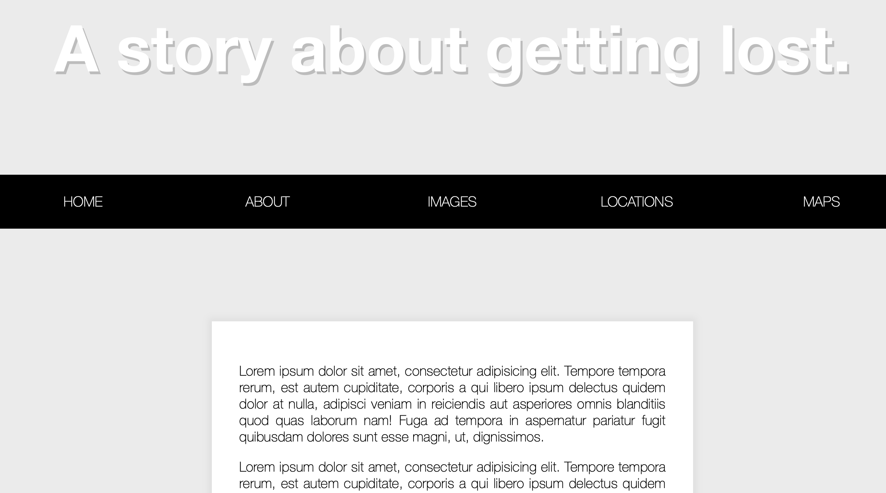

# sticky_nav

This is a 30-days javascript grinding  
js30 [https://github.com/ningh98/js30]  
24. sticky_nav [https://github.com/ningh98/sticky_nav]

## Table of contents

- [Overview](#overview)
  - [Screenshot](#screenshot)
  - [Links](#links)
- [My process](#my-process)
  - [Built with](#built-with)
  - [What I learned](#what-i-learned)


## Overview

The document creates a webpage with a sticky navigation bar that becomes fixed at the top when the user scrolls down. It includes a header with a background image and several paragraphs of placeholder text.

### Screenshot




### Links

- Live Site URL: [https://ningh98.github.io/sticky_nav/]

## My process

### Built with

- HTML
- CSS
- Javascript


### What I learned


```js

const nav = document.querySelector('#main')
const topOfNav = nav.offsetTop
function fixNav(){
    if(window.scrollY >= topOfNav){
        document.body.style.paddingTop = nav.offsetHeight + 'px'
        document.body.classList.add('fixed-nav')
    } else {
        document.body.style.paddingTop = 0
        document.body.classList.remove('fixed-nav')
    }

}

window.addEventListener('scroll', fixNav)

```